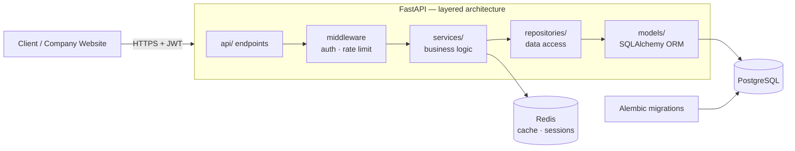

# Chatbot SaaS Platform

A production-grade, **multi-tenant SaaS backend** for deploying AI-powered chatbots — companies sign up, get isolated workspaces, manage their users and websites, and run their own branded chatbot. Built with **FastAPI**, **PostgreSQL**, and **Docker**, with the layered architecture of a real enterprise service (API → services → repositories → models).


---

## Key Features

- **Multi-tenancy** — every company gets isolated data; a single deployment serves many organizations
- **Three-tier RBAC** — System Admin → Company Owner → Company Users, enforced at the API layer
- **Subscription tiers** — Free / Starter / Professional / Enterprise plan management built in
- **JWT authentication** — access + refresh tokens, bcrypt password hashing, token expiry policies
- **Async from top to bottom** — FastAPI + SQLAlchemy 2.0 async + `asyncpg` driver
- **Versioned schema migrations** with Alembic
- **Redis** for caching and session/rate-limit state
- **Rate limiting, structured JSON logging, Sentry-ready monitoring**
- **Fully Dockerized** — API + PostgreSQL + Redis with one command

## Architecture



**Why layered?** Endpoints stay thin, business rules live in services, and repositories isolate SQL — so features (new subscription tier, new LLM provider) land without touching unrelated code, and every layer is testable in isolation.

## Project Structure

```
app/
├── main.py          # App factory, startup, router registration
├── api/             # Versioned REST endpoints (/api/v1)
├── core/            # Settings, security, init_db bootstrap
├── middleware/      # Auth, rate limiting
├── models/          # SQLAlchemy ORM models
├── repositories/    # Data-access layer
├── schemas/         # Pydantic request/response models
├── services/        # Business logic
├── exceptions/      # Domain exceptions → HTTP errors
└── utils/           # Shared helpers
alembic/             # Database migrations
docker/              # docker-compose stack
```

## Getting Started

### 1. Configure environment

```bash
cp .env.example .env   # then set SECRET_KEY, DB credentials, SMTP, etc.
```

### 2. Run the stack

```bash
cd docker
docker compose up --build
```

This starts PostgreSQL, Redis, and the API.

### 3. Initialize the database

```bash
alembic upgrade head
python -m app.core.init_db   # creates superadmin, default plans, demo company
```

### 4. Explore the API

| Resource | URL |
|---|---|
| Swagger UI | http://localhost:8000/docs |
| ReDoc | http://localhost:8000/redoc |
| Health check | http://localhost:8000/health |

> Local development without Docker: create a venv, `pip install -r requirements.txt`, then `uvicorn app.main:app --reload`.

## Engineering Highlights

- **65% query-time reduction** via strategic indexing on hot columns (`session_id`, `created_at`, `chatbot_id`)
- Safe concurrent writes using database-level constraints + optimistic locking
- Message-level **token tracking and cost calculation** per chat session
- Test suite with `pytest` + `pytest-asyncio` + `httpx`

## Tech Stack

FastAPI · SQLAlchemy 2.0 (async) · PostgreSQL + asyncpg · Alembic · Redis · JWT (python-jose) · passlib/bcrypt · Docker Compose · pytest

## Security Notes

All credentials are supplied via environment variables (`.env` is gitignored; see `.env.example`). Default bootstrap accounts are for local development only — rotate them in any real deployment.
